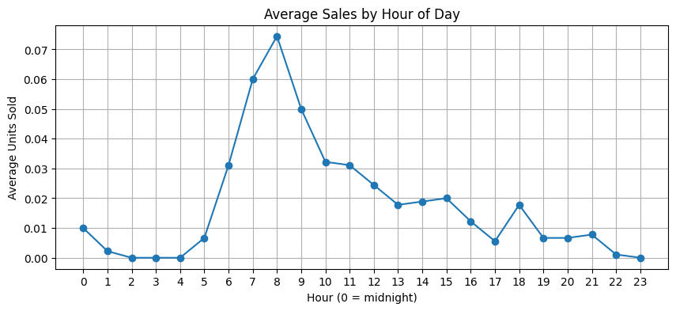
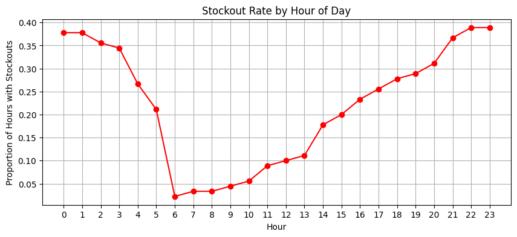
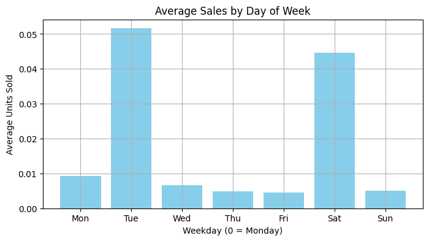

# 🛒 Stockout-Aware Product Demand Forecasting using FreshRetailNet‑50K

This project aims to forecast hourly product demand in retail stores while accounting for real-world complexities such as stockouts, promotions, holidays, and weather effects. It uses the [FreshRetailNet-50K](https://huggingface.co/datasets/Dingdong-Inc/FreshRetailNet-50K) dataset — a large-scale, real-world perishable goods sales dataset from 898 stores across 18 cities.

---

## 🌟 Problem Statement

> **How can we accurately forecast hourly product demand in retail stores while accounting for stockouts, promotions, and contextual factors like weather and holidays?**

This project focuses on building a forecasting system that:

* Recovers **true latent demand** during stockout periods
* Models **temporal and contextual patterns** driving demand
* Supports inventory planning and loss prevention strategies

---

## 🧠 Dataset Summary

* **Source**: [FreshRetailNet-50K](https://huggingface.co/datasets/Dingdong-Inc/FreshRetailNet-50K)
* **Granularity**: Hourly sales for 863 perishable SKUs
* **Stores**: 898
* **Time Window**: 90 days
* **Key Columns**:

  * `hours_sale`: Units sold per hour
  * `hours_stock_status`: 1 = stockout, 0 = in-stock
  * `discount`, `activity_flag`: Promotion metadata
  * `holiday_flag`, `precpt`, `avg_temperature`: Contextual features

---

## 📊 Exploratory Data Analysis (EDA)

### ✔️ Hourly Trends

* Peak demand between **6 AM to 9 AM**
* Stock replenishment typically occurs early in the day

### ✔️ Weekday Behavior

* Highest sales on **Tuesdays** and **Saturdays**
* Minimal activity mid-week

### ✔️ Stockout Analysis

* High stockout frequency overnight and late evening
* Low stockouts in early morning (restock hours)

### ✔️ Promotions & Discounts

* Discounts do not show clear uplift in current subset
* Needs further segmentation or larger-scale comparison

---

## 📈 Sample Visualizations

<p float="left">
  
    
  
</p>
<p float="left">
    
  <!--  -->
</p>

---

## 🧩 Next Steps

* [ ] **Latent Demand Recovery**: Estimate true demand during stockouts
* [ ] **Train forecasting models** (LightGBM, LSTM, TFT)
* [ ] Evaluate performance on multiple time horizons
* [ ] Visualize store/product-level predictions

---

## 📂 Project Structure

```
.
├── notebooks/
│   ├── 01_eda.ipynb
│   └── 02_stockout_visualization.ipynb
├── data/
│   └── delivery_sh.csv / loaded datasets
├── docs/
│   ├── hourly_sales.png
│   ├── stockout_rate.png
│   └── discount_impact.png
├── README.md
└── requirements.txt
```

---

## 📌 Dependencies

```bash
pip install -r requirements.txt
```

---

## 🙌 Credits

* Dataset by [Dingdong-Inc](https://huggingface.co/datasets/Dingdong-Inc/FreshRetailNet-50K)
* Inspired by operational research in retail demand planning
